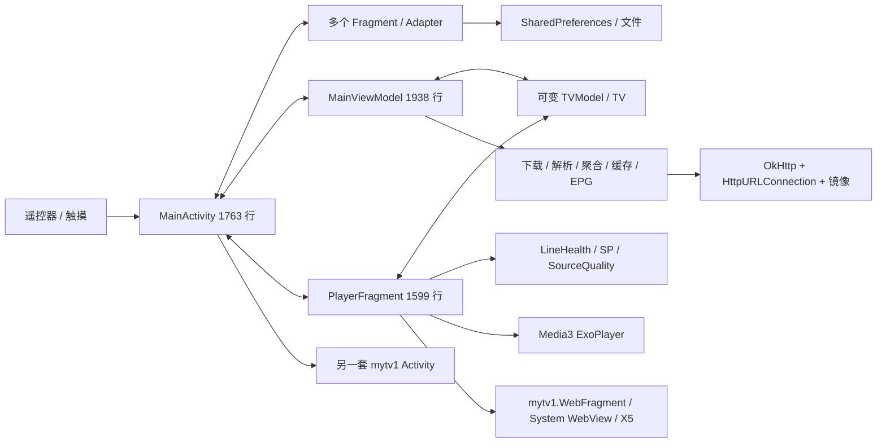

# 全量代码审计与演进依据

基线、范围及文档状态见 [README](README.md)。以下定位均针对 `1b47d74`；“确认”表示代码路径或本地复核成立，“待实测”表示设备/网络表现尚未验证。P0 为首批观看阻断问题，P1 为明显体验或维护缺口，P2 为后续整理项。

## 1. 全仓覆盖

基线共有 287 个受版本控制文件，主源码为 99 个 Kotlin 文件、23,074 行，25 个 XML 布局。完整清单及 SHA-256 见 [inventory.csv](evidence/inventory.csv)。统计从 Git 对象读取，排除未跟踪的密钥、构建缓存和个人文件；二进制只盘点元数据，FFmpeg AAR 另检查了包内 ABI 与类目录。

| 范围 | 文件数 | 审计重点与处理方向 |
|---|---:|---|
| `yourtv` 主 Kotlin 包 | 63 | 播放、启动、目录、网络、设置、持久化、异常与远程配置；关键调用路径逐段核对 |
| `mytv1` 旧 Kotlin 包 | 36 | 第二套 Activity/菜单/设置/模型/HTTP，仍被 Web 模式与嵌入 WebFragment 使用；不能整包当作死代码删除 |
| `res` | 94 | 25 布局、三套字符串、焦点/颜色/尺寸、原始列表和站点脚本；资源扫描结合界面控制代码复核 |
| `assets` | 3 | 内置频道 JSON、网页脚本、黑名单；全量解析 JSON 结构，追踪网页播放生命周期 |
| 单测 | 6 | 分类、元数据、质量、网络策略及两个研究输出类；缺少播放和 UI 状态测试 |
| 工具与研究数据 | 43 | Python 探测/生成逻辑、历史 JSON、ANR、测试服务器；历史日志不充当当前播放实测 |
| 历史文档/README | 15 | 版本演进、已实现修复、仍矛盾的承诺及失效验收口径 |
| 构建/发布/其余 | 27 | Gradle、Manifest、版本/签名、AAR、图像等；无构建 CI 工作流，只有 issue 模板 |

普通辅助类（扩展、二维码、端口、数据 DTO、确认弹窗）通过全仓符号/生命周期/网络扫描和调用关联检查纳入范围；没有强行给每个文件编造问题。文档不声称已完成闭源依赖内部审计或所有页面视觉实测。

## 2. 现状架构与保留成果

三个中心类合计 5,300 行，承担了大量互相回调的业务。播放器不是独立会话：Fragment 直接修改频道模型、读取偏好、写健康记录、选择线路、控制维护任务，再回调 Activity 换线。目录刷新会替换可变模型，界面则从多个“current/position/positionPlaying”读取状态。

应保留并验证的成果：

- 有内置频道快照和本地缓存，主播放已经复用**一个** ExoPlayer；v3.0 双播放器说明不能代表当前实现。
- 已将密集分类构建移出主线程，已有频道规范化/分类测试、逐线路请求头/来源字段、每频道八条和每主机两条候选限制。
- `LineHealth` 已区分播放与探测成功，失败可恢复退避，异步节流持久化；不能重复报告成旧版“一次失败永久封死”。
- 数字输入已有空列表保护；错误页已有重试按钮；收藏已有独立焦点入口；搜索/最近观看、比例、今天/明天 EPG 和定时停止已经存在。
- 主入口已有 Fragment 恢复重绑定、部分观察者清理，不能再照抄 v3.0 审计的已修复结论。

## 3. 观看链路的首批问题

### A01 · P0 · 浏览位置与正在播放频道没有独立真值（确认）

证据：[TVGroupModel](../../../app/src/main/java/com/horsenma/yourtv/models/TVGroupModel.kt#L252) 的 `getCurrent()` 返回当前浏览分组中的 `position` 对象，而非 `_current` 或播放器会话；[MainActivity.watch](../../../app/src/main/java/com/horsenma/yourtv/MainActivity.kt#L595) 用这一结果决定错误显示；`sourceUp()` 也从这里取得频道。[MenuFragment](../../../app/src/main/java/com/horsenma/yourtv/MenuFragment.kt#L283) 浏览分组时就会更新目录位置。

因此“正在看 A，打开菜单浏览 B，A 在此时出错”可能把恢复指令作用到 B；即使此前已禁止在错误分支显式调用 next，也未消除这种频道漂移来源。`applyChannelList()` 先清空分组，再重新读取 current，且只在 ID 不同时重绑定，进一步增加旧对象引用风险。目标：播放会话保存不可变 `channelId`，浏览焦点独立；刷新只替换目录快照，恢复只能在会话频道内进行。

### A02 · P0 · “首帧”实际用 isPlaying 判断，缺少画面停滞证据（确认）

证据：[PlayerFragment](../../../app/src/main/java/com/horsenma/yourtv/PlayerFragment.kt#L465) 在 `onIsPlayingChanged(true)` 置位 `attemptPlayed`、写播放成功；首帧看门狗只检查 BUFFERING。全仓未发现 `onRenderedFirstFrame`、视频丢帧或音频欠载统计。

播放器处于播放状态不证明用户已看到视频，更不证明之后画面继续推进；音频正常而视频异常时可能被记为健康。目标：首帧使用视频渲染回调，稳定度使用连续播放、重缓冲和渲染数据。节目本身的静止画面不能仅凭像素不变判为卡死。依据：[Player.Listener](https://developer.android.com/reference/androidx/media3/common/Player.Listener)。

### A03 · P0 · 恢复分支没有共同预算，单线路与全坏线路行为不完整（确认）

证据：[onPlayerError](../../../app/src/main/java/com/horsenma/yourtv/PlayerFragment.kt#L606) 在前部就调用 `switchSource`，先于自动换线开关与部分错误分类；[switchSourceInternal](../../../app/src/main/java/com/horsenma/yourtv/PlayerFragment.kt#L1036) 不检查总次数；[TVModel.nextVideo](../../../app/src/main/java/com/horsenma/yourtv/models/TVModel.kt#L271) 全部冷却时仍循环到下一条，`hasNextHealthyVideo()` 在多线路时恒为 true。`maxAutoSwitchPerChannel=5` 只约束缓冲事件分支，无法证明整体有界。

单线路时 `nextVideo=false` 直接停止，缺少“在本线路修复连接/回到直播点”的步骤。还有部分 `nextVideo()` 后调用 Activity `sourceUp()` 的双重前进路径；匿名延迟任务捕获可变 `tvModel`，没有请求代次，可能干扰后续用户选择。目标：统一恢复决策、单调时钟、会话代次、已尝试集合、总时间与次数预算；用户取消不计为线路失败。

### A04 · P0 · 短暂抖动、窗口过期与坏源被相似处理（确认）

证据：[TVModel](../../../app/src/main/java/com/horsenma/yourtv/models/TVModel.kt#L248) 对 HLS/DASH/渐进流统一返回 `C.TIME_UNSET` 放弃加载重试；[播放轮询](../../../app/src/main/java/com/horsenma/yourtv/PlayerFragment.kt#L840) 对出过画后的停播使用 2.5 秒阈值、2 秒轮询，满足冷却即换线；另有缓冲事件策略，两套规则并行。

`onIsPlayingChanged(false)` 清零 `playbackStartTime`，恢复 true 又清缓冲历史，难以得到有效的滚动卡顿统计。没有针对 `ERROR_CODE_BEHIND_LIVE_WINDOW` 的本线定位恢复，也没有网络离线状态。目标：短暂分片错误小预算重试；窗口过期本线恢复；真正的线路失败才换线。依据：[Media3 直播窗口与恢复](https://developer.android.com/media/media3/exoplayer/live-streaming)。

### A05 · P0 · 解码选择可能牺牲电视硬解，重建后没有恢复媒体（确认代码，性能待实测）

证据：[PlayerMediaCodecSelector](../../../app/src/main/java/com/horsenma/yourtv/PlayerFragment.kt#L1417) 在 API 23 优先仅返回软件解码器，在 H.265 分支又优先 `c2.android.hevc.decoder`，没有结合分辨率/帧率/设备失败记录。`rebuildPlayers()` 只 release/create，未恢复原 MediaItem；设置开关直接调用它（[SettingFragment](../../../app/src/main/java/com/horsenma/yourtv/SettingFragment.kt#L179)）。

目标：硬解能力优先，针对失败进行一次可控重建并恢复同频道；“软件解码”改为能力说明明确的高级选项。本地 FFmpeg AAR 含四种 ABI 和 `ExperimentalFfmpegVideoRenderer`，仅有这些类不证明当前接入路径或旧盒子软件 4K 可用。

## 4. 源、网络与数据一致性

| ID / 优先级 | 确认的代码证据与影响 | 演进要求 |
|---|---|---|
| A06 / P0 | [MainViewModel 140–185、191–250、1609 起](../../../app/src/main/java/com/horsenma/yourtv/MainViewModel.kt#L140)：playbackActive 持续为 true 就推迟源/EPG，包括手动刷新；错误停止分支未将它清为 false。退出/后台空闲只是机会窗口，不能保证完成维护 | 明确用户请求、自动维护、故障抢救三类优先级；可控低带宽刷新与故障后刷新有进度/终态 |
| A07 / P0 | [DownGithubPrivate.downloadFile](../../../app/src/main/java/com/horsenma/yourtv/DownGithubPrivate.kt#L173) 使用阻塞 HttpURLConnection、整段 readText、捕获 Exception；外层协程 timeout/cancel 未连接到 socket 关闭，普通下载路径无 finally disconnect | 统一可取消网络层；请求/响应/总字节上限；取消关闭 body/socket；旧任务不可提交结果 |
| A08 / P1 | [LineHealth](../../../app/src/main/java/com/horsenma/yourtv/LineHealth.kt#L30) 只按 URL 保存；[DnsCache](../../../app/src/main/java/com/horsenma/yourtv/requests/DnsCache.kt#L10) 无 TTL、无网络切换失效，固定 IPv4 在前；[HttpClient](../../../app/src/main/java/com/horsenma/yourtv/requests/HttpClient.kt#L25) lazy 固化代理客户端 | 网络代次/画像隔离证据；DNS 有界缓存与网络切换失效；代理变更生成新客户端 |
| A09 / P1 | [SourceNetworkPolicy](../../../app/src/main/java/com/horsenma/yourtv/SourceNetworkPolicy.kt#L120) 把所有 `fc/fd/fe8…/ff` 开头的普通域名也当 IPv6 私网；本地执行 `fc-live.example` 得 PRIVATE。公网过滤也用于用户导入/缓存路径，192.168 源不可进入候选 | IP 字面量解析后判地址范围；公开目录准入与显式局域网源准入分开；运营商标签仅弱先验 |
| A10 / P1 | [probeLine](../../../app/src/main/java/com/horsenma/yourtv/MainViewModel.kt#L1783)：416 直接成功，200/206 只读到一个字节即成功；成功与播放首帧共用 latency EWMA | 传输、清单、媒体分片、可解码、稳定播放分级证据；探测耗时与首帧独立 |
| A11 / P0 | [saveChannelsCache](../../../app/src/main/java/com/horsenma/yourtv/MainViewModel.kt#L1553) fire-and-forget 直接 writeText；applyChannelList 另起协程。导入先覆盖缓存再解析，失败删除文件；聚合只有“成功源≥2”门槛 | 按源 last-known-good、不可变 generation；临时写/校验/原子替换，失败保留旧快照，事务完成后报告成功 |
| A12 / P1 | [aggregateRemainingSources](../../../app/src/main/java/com/horsenma/yourtv/MainViewModel.kt#L370) 输入只有 activeUrl + DEFAULT_SOURCES；[Sources](../../../app/src/main/java/com/horsenma/yourtv/models/Sources.kt#L35) checked 是单选状态；删除默认源不改变聚合输入 | 显式 Source.enabled/order/scope 持久化；所有启用自定义源参与聚合；用户停用不被默认导入复活 |
| A13 / P1 | [str2Channels](../../../app/src/main/java/com/horsenma/yourtv/MainViewModel.kt#L1238) 先按 EXTINF 分流，普通 JSON 行不能进入 iptvLines，后面的 JSON 分支无法覆盖普通 JSON 数组；file 以外 URI 走远程下载，content:// 无专门读取 | 格式检测在最前；独立 M3U/TXT/JSON/旧加密适配器；SAF ContentResolver 导入，统一预览/校验/提交 |
| A14 / P1 | [保存稳定源](../../../app/src/main/java/com/horsenma/yourtv/PlayerFragment.kt#L950) 保存 tv.headers，未保存所选 URI 的专用头；恢复时可能覆盖正确 uriHeaders。`#EXTVLCOPT:http-referrer` 原样存为 referrer；[build_bundled.py](../../../tools/build_bundled.py#L205) 输出无 headers | LineEndpoint 保存有效请求头、重定向策略、来源和有效期；Referer 标准化；生成链路使用同一数据契约 |
| A15 / P1 | URL/source 启发式分散在 SourceQuality、SourceNetworkPolicy、MainViewModel、PlayerFragment、Python；快照来源是 `bestfan_cn_all.m3u8` 等文件标签，部分运行时权重期待域名或 `best-fan` | 统一 SourceId/FailureDomainId、共享测试向量；候选数量和独立故障域分别统计，避免镜像/同供应商假多源 |

## 5. UI/UX 与常用功能闭环

| ID / 优先级 | 当前缺口及定位 | 目标行为 |
|---|---|---|
| A16 / P1 | [SearchFragment](../../../app/src/main/java/com/horsenma/yourtv/SearchFragment.kt#L90) 只接数字/字母/删除；[search.xml](../../../app/src/main/res/layout/search.xml#L30) query 是不可输入 TextView，没有屏幕键盘。空列表时也没有可聚焦输入入口 | 五向遥控器本地键盘、拼音首字母、中文别名、退格按钮；手机输入仅辅助 |
| A17 / P1 | [ChannelFragment](../../../app/src/main/java/com/horsenma/yourtv/ChannelFragment.kt#L67) 无 number 时显示 id+1；数字播放找到 number 后把 hash id 交给索引式 MainActivity.play。[buildChannelModel](../../../app/src/main/java/com/horsenma/yourtv/MainViewModel.kt#L1710) 已改 ID 为 hash；本地 CCTV1 hash 为 -1060187977 | ChannelId、displayNumber、列表位置彻底分离；自定义番号唯一，搜索/数字直选都按 ID 播放 |
| A18 / P0 | [EPGXmlParser](../../../app/src/main/java/com/horsenma/yourtv/models/EPGXmlParser.kt#L27) 未读取 programme.channel，而用最近出现 channel 的 display-name；标准“先所有 channel、后所有 programme”结构会错误归属。[readEPG](../../../app/src/main/java/com/horsenma/yourtv/MainViewModel.kt#L688) 再做名称 contains 匹配并在 Main 写缓存 | 保存 tvg-id/EPG channel id，按 ID 关联；解析/持久化后台；按时区归日、可靠空态 |
| A19 / P1 | Activity/Fragment/Adapter 各自消费按键；[MenuFragment](../../../app/src/main/java/com/horsenma/yourtv/MenuFragment.kt#L531) 用 1 秒窗口压制第二次 BACK，可能吞真实连续返回；按键/延迟 requestFocus 与多个自动隐藏计时器交错 | 单一 OverlayState/FocusAnchor；按事件去重；Back 一次退一层；确认才播放；交互面板不定时消失 |
| A20 / P1 | [MainActivity.watch](../../../app/src/main/java/com/horsenma/yourtv/MainActivity.kt#L595) 每次 change 再注册新的 ready/error observer lambda；只缓存 throttle，未缓存这些观察者。old 模型由 throttle 列表持有直到 Activity 销毁 | 只订阅当前播放会话和目录 snapshot；列表展示用不可变 DTO + DiffUtil，生命周期内单一收集 |
| A21 / P1 | [SP.sleepTimerMinutes](../../../app/src/main/java/com/horsenma/yourtv/SP.kt#L255) 保存 deadline；[checkSleepTimer](../../../app/src/main/java/com/horsenma/yourtv/MainActivity.kt#L543) 到期 finishAffinity 不清 deadline，重进仍可能到期退出；设置显示原分钟数而非剩余时间 | 名称为“定时停止播放”，触发前清除一次性任务，准确剩余时间/取消；不宣称可关闭电视硬件电源 |
| A22 / P1 | 三层列表、40dp 行、30dp 头部、小字体和多套 px/dp 二次缩放；线面板混合 probe latency/首帧。无设备截图验证 | 960×540dp 参考网格、稳定焦点和内容标识、清晰文案；分辨率与已在本网络验证的状态分开 |

## 6. 系统、兼容与工程治理

| ID / 优先级 | 证据与判断 | 演进要求 |
|---|---|---|
| A23 / P1 | 两套 [HttpClient](../../../app/src/main/java/com/horsenma/yourtv/requests/HttpClient.kt#L70) 均跳过证书/主机名验证，WebFragment 遇 SSL 错误 proceed。对节目目录和 APK 元数据同样使用宽松客户端，增加错误内容被接受的风险 | 恢复平台信任；HTTP 媒体按源声明兼容；目录更新签名/校验；设备时间错误有明确说明，禁止全局信任所有证书 |
| A24 / P1 | [SimpleServer](../../../app/src/main/java/com/horsenma/yourtv/SimpleServer.kt#L30) 随 ready 启动，无配对校验；import 返回排队成功时即 toast 成功；`/api/sources` 依赖额外远端。隐式外部配置可影响观看 | 用户开启限时配对窗口；随机会话 token、方法/请求体约束；异步 import job 明确成功/失败；本地配置独立可用 |
| A25 / P1 | [YourTVApplication](../../../app/src/main/java/com/horsenma/yourtv/YourTVApplication.kt#L74) 无条件初始化 X5；Utils 初始化查询外部时间；ImageHelper/Glide 不受播放维护门控；崩溃路径 [saveLog](../../../app/src/main/java/com/horsenma/yourtv/YourTVExceptionHandler.kt#L77) 尝试外部 POST | optional 模块懒加载；台标文字兜底与预算；崩溃先落本地，用户导出诊断；默认观看无远程账号/时钟依赖 |
| A26 / P1 | MediaSession/音频焦点策略未接入；默认熄屏音频为 true，电视隐藏该开关；播放生命周期分散 Activity、Fragment、广播、PiP。[WebFragment](../../../app/src/main/java/com/horsenma/mytv1/WebFragment.kt#L718) 独立 30s/60s 重载策略、console success 判断 | 共用播放器接口和生命周期决策；电视待机停止，音频后台显式功能；Web 仅作为单独可选引擎 |
| A27 / P2 | 同时声明 ExoPlayer 2.19.1、Media3 1.1.1/1.5.1；实际 Gradle 将 Media3 解析到 1.5.1，所以不能直接称版本冲突崩溃。AAR 无可复现构建说明；versionCode 十进制拼法遇 minor≥10/patch≥10 可碰撞；Makefile 使用不同版本编码 | 统一依赖与单调 versionCode，固定 AAR 来源/哈希/构建参数；目标版本升级独立验证，不追随 latest 自动升级 |
| A28 / P1 | [ResearchClassificationDump](../../../app/src/test/java/com/horsenma/yourtv/ResearchClassificationDump.kt#L23) 硬编码 D 盘路径并写研究 JSON；无 LineHealth、恢复、导入事务、EPG、焦点和迁移断言；无 CI workflow | 单测纯化、研究工具拆出；补故障与时序测试、离线 fixture、构建/设备分层门禁 |

历史自动版本检查函数中仍有强制退出分支，但全仓只找到定义与自身延迟调用，未确认主入口启用，故列为清理项，**不认定当前用户正在被强制更新退出**。类似源码注释与实际调用不一致，后续都按可达路径判断。

## 7. 内置数据的真实结构与局限

以下由 [audit_snapshot.py](audit_snapshot.py) 复算，**不含此次网络播放探测**：

| 项目 | 当前值 | 含义 |
|---|---:|---|
| 频道 / 线路槽位 / 唯一 URL | 521 / 1003 / 976 | 不同频道存在重复地址，需审查误合并/内容一致性，不直接判错 |
| 单线路频道 | 363（69.7%） | 多数频道缺少立即可用的备线结构 |
| 全部线路同一 host 的频道 | 431（82.7%） | 仅 90 个频道跨 host；不同 host 也可能共用上游 |
| HTTP / HTTPS 槽位 | 769 / 234 | 不能“一刀切禁 HTTP”实现兼容；控制数据可信链路另行保障 |
| IPv6 字面量槽位 | 1 | 仅描述 URL 字面量；域名也可能解析 AAAA，不能说只有一条源支持 IPv6 |
| 具有 headers / uriHeaders 的频道 | 0 / 0 | 内置生成链路未携带请求头，不能证明所有这些线路都需要或不需要头 |
| 默认订阅列表 | 11 | 5 个 raw.githubusercontent.com、4 个 GitHub Pages；控制平面仍集中于少数托管平台 |

CCTV1/5/13 各有 8 条候选，但数量不能证明跨网稳定。内置标签还含 `vicjl_TV-IPV4.m3u` 22 条、`migu_sports.m3u` 119 条等不在当前默认列表中的历史来源。它们不因“旧”就必然失效，却显示缺少来源版本和淘汰链路。

`build_bundled.py` 输入 `probe_lines_results.json` 不在该基线 Git 中；输出未记录探测省份/运营商/时间/协议/请求头。其 `select_diverse()` 在全频道没有 alive 条目时先返回空，因此后续保留运营商备线的逻辑无法挽救“构建网络全不通、家庭网络可能通”的频道。这是采样选择偏差，应通过按区域标注和多网络证据修正，不能用单点失败全局删除。

## 8. 历史方案对照

- v3.0 的双播放器预加载/连接预热已被当前单播放器方案取代；本设计保留观看资源优先，暂不恢复预加载。
- v3.1 的错误页、收藏反馈、Fragment/observer 部分修复保留；新增缺口是状态所有权、五向可达性和完整流程验证。
- v3.2 的“快速失败”对起播黑屏有帮助，却统一应用到长播分片失败，需区分启动/播放中恢复。
- v3.3 的聚合与稳定 ID 思路保留；ID 改造未覆盖编号、浏览位置、EPG、稳定源全部链路。其“断网首频道秒开”不能作为直播验收条件。
- v3.4 的健康退避和后台降载保留；补上网络画像、真正可取消 I/O、维护饥饿恢复和按源事务。不能将所有源更新都无限等到退出。

这些问题对应 [架构设计](02-architecture.md)、[交互规范](03-experience.md) 和 [实施门槛](04-delivery.md)，不以“再增加一个设置开关”作为默认解决方式。
