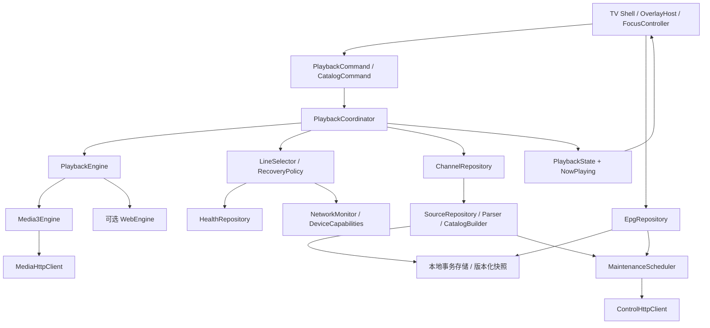
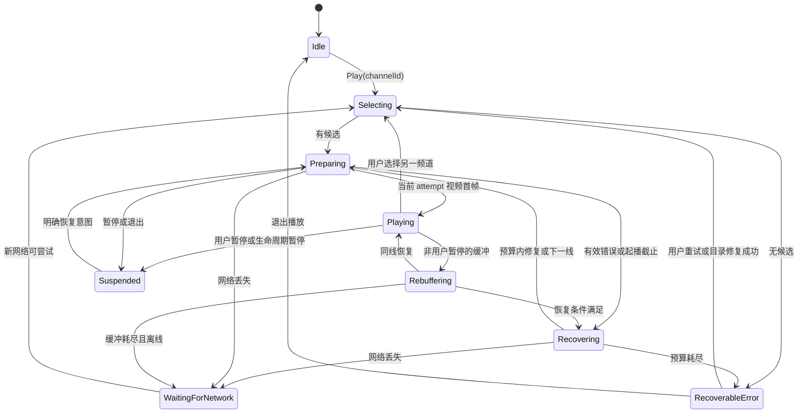
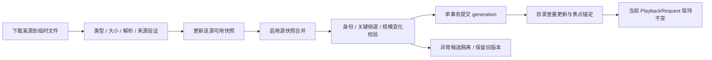

# 架构、观看链路与三网源治理设计

状态：设计方案，尚未实施。输入见 [审计报告](01-audit.md)。文中时间、数量和内存参数是首轮实验值，须按 [验收计划](04-delivery.md) 校准；不等同于当前性能或任意公共源的服务保证。

## 1. 设计原则与边界

优先级：**持续有画面且有正常声音 > 出错后可恢复 > 用户能准确选台 > 起播速度 > 清晰度 > 频道覆盖 > 附加功能**。最高分辨率不能凌驾于可持续吞吐、解码能力和观看连续性。清晰度自动模式先保证稳定，用户可选择偏好，但不能使客户端产生线路本身没有的低码率版本。

必须成立的约束：

1. 一个用户播放意图对应一个 `PlaybackSession`；任意时刻最多一个具有网络加载权限和输出音频的播放引擎。
2. 浏览/收藏/打开设置不会改变 `playingChannelId`。只有明确的选台、上一台/下一台、数字确认或返回上一台命令改变频道。
3. 所有恢复请求由同一状态机裁决，带 session/attempt/network 代次；过期回调不写 UI、不写健康、不启动下一次播放。
4. 目录/EPG/更新/台标失败不清空可用目录、不强制退出、不阻断当前节目。
5. 播放中的线路“粘住”：后台发现更高分线路不主动换线。切线仅为用户选择或明确恢复需要。
6. 本地用户数据不依赖远端账号、外部时间 API、GitHub 或 Google 服务；时效和健康数据可以缺失，系统仍可启动。
7. 网络身份和运营商识别不确定时，标记未知；不把 URL 特征、HTTP 状态或一个机房的结果当作三网事实。

## 2. 演进后的模块边界

先在现有 `app` 中按 package 和接口分层，避免一次性重写或同时引入多个 Gradle 模块。第一阶段保留 Kotlin、Views/XML、RecyclerView 与 Media3。状态和协议稳定后，再提取可独立编译的纯 Kotlin 核心。



| 模块 | 拥有的数据/职责 | 禁止承担的职责 | 迁移来源 |
|---|---|---|---|
| `tv.shell` | 浮层栈、焦点锚点、导航、遥控器归一化 | 直接选 URL、调用 prepare、改变线路健康 | MainActivity / Menu / 各 Fragment |
| `playback.core` | 会话、意图、状态机、恢复预算、命令串行化 | 引用 Activity、读取 SP、访问 View | PlayerFragment / TVModel |
| `playback.media3` | 播放器、Surface、媒体源、轨道、监听和解码适配 | 决定切到另一个频道、持久化目录 | PlayerFragment / TVModel |
| `catalog` | 频道身份、来源/线路关系、导入、目录快照 | 因浏览位置更改播放会话 | MainViewModel / models |
| `network` | 网络事件、客户端工厂、取消、超时、流量计数 | 通过公网 IP 服务阻塞启动 | requests / DownGithubPrivate / Utils |
| `quality` | 按网络/设备保存事实、候选排序、故障域和冷却 | 未经用户操作主动升级正在播放线路 | LineHealth / SourceQuality |
| `epg` | channel-id 关联、时区、缓存、按天查询 | 通过“节目标题像某频道”改播放频道 | EPGXmlParser / MainViewModel |
| `storage` | 事务、迁移、last-known-good、用户偏好/密钥引用 | 把大 JSON 序列化放播放器回调 | SP / 零散文件 |
| `maintenance` | 统一队列、优先级、断点/取消、任务状态 | 绕过播放资源预算自行建线程 | 各网络后台任务 |
| `legacy.web` | 明确需要网页的频道适配及有界重载 | 运行第二套频道/设置真值 | mytv1 |

`MainViewModel` 最终只组合 UI 所需的 StateFlow。UI 经 `repeatOnLifecycle` 收集可见页面状态；不为全部频道常驻注册 ready/error 观察者。初期可以用适配层向原 LiveData 输出，迁移后移除旧发布者，确保一个状态只有一个写入者。

## 3. 数据契约

### 3.1 不可变领域对象

| 对象 | 关键字段与约束 |
|---|---|
| `Channel` | `channelId:String`、displayName、aliases、category、region、displayNumber、epgBindings、lineIds；ID 不从显示文本或排序下标临时计算 |
| `Source` | `sourceId`、name、subscriptionUri/localFileRef、enabled、priority、scope(public/lan/user)、lastSuccess、expiresAt、refreshStatus、provenance；enabled 是多选持久状态 |
| `LineEndpoint` | `lineId`、channelId、sourceIds、uri、protocol、requestProfileId、failureDomainId、networkScope、validUntil、declaredFormat、observedFormat、capabilities |
| `RequestProfile` | UA/Referer/Origin、密钥引用、Cookie/Authorization 的用途与允许 origin；不向日志/分享包写明文密钥 |
| `HealthRecord` | `(lineId,networkProfileId,deviceProfileId)`、证据级别、样本数、首帧分布、观看时长、卡顿、失败原因、冷却、observedAt |
| `CatalogSnapshot` | schemaVersion、generation、policyVersion、builtAt、sourceVersions、内容 hash、channels/lines、上个可用版本引用 |
| `UserState` | 收藏/自定义排序/隐藏频道、最近有效观看、lastPlayedChannelId、preferredLineId、比例/音轨、启动/睡眠偏好 |
| `PlaybackSession` | sessionId、channelId、catalogGeneration、engineType、attemptId、selectedLineId、intent(play/pause)、startedAt、attemptedSet、recoveryBudget |
| `BrowserState` | categoryPath、focusedChannelId、focusedAction、scrollAnchor、query；不携带“修改当前播放”的副作用 |

官方/人工校准的频道用明确命名空间 ID；用户源先使用 `sourceId + providerEntryId`，缺乏 ID 时分配本地 UUID 并保存别名映射。名称/地区启发式只能提出合并建议，歧义的同名“新闻综合”保留两台。规范化规则版本升级通过别名映射迁移，不能改变已有 ID。

显示番号与 ID 分开。系统常用频道有稳定番号，自定义番号冲突在编辑时提示；数字输入查 `number -> channelId`。排序下标仅是瞬时 UI 信息，不持久化为身份。

线路身份不能简单等于 URL：同一 URL、不同请求头/授权或播放协议可能需要不同 endpoint；多个订阅引用同一真实 endpoint 则合并 sourceIds。签名 URL 仅在明确提供方规则下拆成稳定资源 ID 与短期 token；不通用删除所有 query 参数去重。没有可信 resolver 时过期 URL 只能从用户配置的订阅刷新。

### 3.2 存储选择

过渡期用 `AtomicFile` 封装目录快照与每源原文，全部在 IO 线程；重构阶段选 Room 保存 Channel/Line/Source/EPG/Health/UserState 的关系和迁移版本，小偏好可暂留 SP，通过 Repository 统一读写。不同时启动 Room 与偏好存储全量迁移。

播放器事件先进入内存聚合器；健康/诊断批量写入，正常播放每 30 秒或会话结束写一次，失败/成功不阻塞主线程。健康最多 5,000 记录，诊断环形上限 10MB，原始日志默认保留 7 天，未使用快照最多保留两代；均为可调整上限，低存储时先淘汰诊断与台标，不删收藏和当前目录。

## 4. 播放会话与恢复状态机



图展示主转换，任意状态均接受 `Stop`、新的 `Play(channelId)` 和生命周期取消。新播放意图取消旧任务、递增 session；同一频道的换线/重建递增 attempt；网络变化递增 networkGeneration。旧引擎回调不因“player 对象相同”就被接受。

网络代次校验按事件用途执行：下载完成、鉴权、探测和网络恢复计时器必须匹配当前 networkGeneration；当前 session/attempt 的已缓冲媒体仍可产生有效渲染事件，不能因断网就把正在输出的画面判为无效。旧网络缓冲消费不记作新网络播放成功。真正重连时建立新请求代次，adapter 明确关联请求和事件；session/attempt 已失效的任何渲染事件都丢弃。

### 4.1 命令与事件

```kotlin
// 接口草案；不是本次已实现代码。
interface PlaybackEngine {
    val events: Flow<EngineEvent> // 每个事件带 sessionId/attemptId/networkGeneration
    suspend fun prepare(request: PlaybackRequest)
    suspend fun resumeAtLivePosition()
    suspend fun suspendPlayback()
    suspend fun stopAndRelease()
}

interface PlaybackController {
    val state: StateFlow<PlaybackState>
    fun dispatch(command: PlaybackCommand)
}
```

核心通过单线程事件循环处理 command/event/timer，Media3 操作仍在其 application looper 上执行。计时使用 `elapsedRealtime` 等单调时钟；持久化时间使用 epoch，重启时不能复用旧 elapsed 值。

恢复不是“所有错误都调用 sourceUp”。恢复动作产生唯一 ID，只有 coordinator 能发出；播放回调中的重复 ERROR/BUFFERING/timeout 被同一 attempt 的完成状态去重。

### 4.2 起播及恢复预算

首轮实验规则：

- 起播直接使用最近在本网络稳定的候选，不先批量测速。候选计划从当前目录生成，执行时冻结，并记录已尝试集合。
- 单次起播默认截止 6 秒，可按已知 HLS 分片/GOP 信息延长到 8 秒，但受总预算限制；每频道自动起播最多 3 个不同 endpoint、总计 20 秒。不是八条候选逐条各等八秒。
- 同线路短暂媒体分片失败允许最多 2 次重试（例如 250ms、750ms 加少量抖动），算入恢复总时间；读到部分数据不自动重置总预算。
- 已稳定播放后，每次故障恢复总计最多 12 秒；滚动 5 分钟最多 2 次自动跨线，达到上限进入可操作错误态。连续稳定 60 秒可结束故障 episode，滚动跨线计数仍保留，避免“播放一秒就清次数”。
- 单线路也可做同线重试、重开连接或回直播点；做完预算即给出重试/目录/诊断入口。
- 已离线时停止耗尽线路候选，不将同一网络故障写成 N 条死源；缓冲尚能播放则继续消费，耗尽后显示等待网络。网络回归只触发一次恢复，去重并等待 500ms 网络变化稳定。
- 用户“重试”明确创建新 recovery episode，可再次尝试冷却线路；重复 OK 只合并正在执行的重试，不无限叠加请求。
- 用户关闭自动换线后，仍允许同线瞬时重试；跨线必须由用户确认。首装也遵守该开关的语义。

### 4.3 分类处理表

| 事件 | 第一动作 | 后续与健康记账 |
|---|---|---|
| 用户切台/暂停/待机 | 取消旧任务或暂停 | 不写失败；保留频道/偏好 |
| 设备网络丢失/切换 | 根据缓冲余量继续或等待 | 更新网络代次，旧冷却不污染新网络 |
| 单次分片超时/临时 5xx | 同线小预算重试 | 故障 episode 记录，不能立即判长期不可用 |
| 直播窗口过期 | 同线 `seekToDefaultPosition + prepare` 一次 | 不先处罚该线路；仍失败再走预算 |
| 404/410、清单非媒体内容 | 当前 endpoint 失败 | 尝试独立故障域；过期订阅进入修复队列 |
| 401/403/签名失效 | 按提供方契约刷新引用一次（若具备） | 不重放旧 token 无限请求；无能力则换候选/提示 |
| 429/Retry-After | 遵守服务器退避 | 对该故障域限流，不换同域镜像绕圈 |
| 解码初始化失败 | 能力筛选后的解码器/较低规格候选 | 设备能力失败独立保存，不惩罚其他设备网络 |
| 没有视频首帧/渲染停滞 | 联合轨道、渲染、position/缓冲事件诊断 | 一次受控重建后同频道换线；非单纯截图像素比较 |
| 长播吞吐不够 | 自适应清晰度下降（如流具备） | 单码率源选择同频道低码率 endpoint；禁止后台升档反复切线 |
| 全部候选失败 | 停止自动尝试并呈现操作入口 | 允许一次按需目录修复；始终保持选中频道 |

Media3 已具备自适应轨道选择，改造是在其能力之上施加设备/偏好约束和稳定策略，不自行重写 ABR 算法。首帧、错误统计和直播位置分别依据 [Listener](https://developer.android.com/reference/androidx/media3/common/Player.Listener)、[Analytics](https://developer.android.com/media/media3/exoplayer/analytics)、[直播文档](https://developer.android.com/media/media3/exoplayer/live-streaming)。

## 5. 缓冲、码率、解码与观看质量

### 5.1 稳定优先的缓冲档位

| 档位 | min/max buffer | 起播 / 重缓冲恢复 | 用途 |
|---|---|---|---|
| 标准（默认） | 8s / 15s | 1.0s / 2.5s | 沿用 v3.4 基线先测，不同时改多个变量 |
| 抗抖动 | 12s / 25s | 1.5s / 4s | 有足够直播窗口与内存、且测得频繁短抖动时 |
| 低内存 | 5s / 10s | 1.0s / 2.5s | 小内存设备，配合更低码率/分辨率上限 |

时间缓冲与内存不是同一指标。8Mbps × 15s / 8 约为 15MB 编码媒体数据，另有解码帧/Surface/音频/Java 开销；不能把整个进程内存预算设成该数值。先对 1GB/2GB 设备分别测内存高水位，限制码率与队列，OOM 保护优先关闭 Web/台标后台工作。

直播 `targetOffset` 是距离直播边缘的延迟，缓冲是尚未播放的媒体量，二者分别记录。默认服从服务端窗口和建议；缓冲扩展不超出现有窗口，不用不断跳到直播边缘掩盖卡顿。受控追赶速度需验证声音体验，首轮采用保守范围或固定 1.0，不默认激进低延迟。

### 5.2 清晰度与设备画像

- `DeviceCapabilities` 读取可用解码器、video size/rate 支持、HDR/音轨和当前输出设备；不以 Android 版本单独决定软解。
- 默认优先可用硬件解码和可持续的 H.264/AAC 组合；HEVC/1080p50/4K/HDR 按实际能力进入候选。不是要求所有频道转码为 H.264。
- 设备初始化失败允许一次 decoder fallback，记录 SoC/codec 名/格式条件下的本地失败。软件视频解码为显式或受控降级，不作为老电视通用“增强兼容”开关。
- 音轨默认可解码并符合语言偏好；电视扬声器以可靠 PCM 输出优先，有外接音响时按当前 AudioCapabilities 决定 passthrough，不假定所有 HDMI 设备支持同样音频。
- Surface 生命周期由 engine adapter 处理，切换设置重建时恢复 session/line/track/比例，不能只建空播放器。长期退到后台释放解码器，返回从同频道合适直播点恢复。
- 将 TV 待机/熄屏默认策略设为停止拉流并暂停音频；“后台听电视”另为显式能力，按平台服务生命周期实现。采用 [MediaSessionService](https://developer.android.com/media/media3/session/background-playback) 时同步声明服务/前台媒体权限并测试 API 23、26 和 target 35 的行为。电视观看首期无后台诉求可先保持前台播放，不为重构强行常驻服务。

格式支持与设备解码能力分开验收，参考 [Media3 格式支持](https://developer.android.com/media/media3/exoplayer/supported-formats)、[轨道选择](https://developer.android.com/media/media3/exoplayer/track-selection)、[TV 音频能力](https://developer.android.com/training/tv/playback/audio-capabilities)。

## 6. 中国大陆三网网络策略

### 6.1 分清四类问题

| 层次 | 常见情况 | 处理 |
|---|---|---|
| 订阅目录可达性 | 托管平台/镜像慢或不可达 | 本地快照 + 条件请求 + 有限备用端点；与视频传输分离 |
| 媒体路径可达性 | 同运营商、跨网、省内路由、鉴权、源站/CDN 不同 | 本机证据优先，按地区/网络标注候选；镜像列表不是媒体 CDN |
| 家庭最后一段网络 | Wi-Fi 干扰、电视网口、路由器、DNS、IPv6 路径不完整 | 读取网络变化与实际媒体请求统计；有针对性的诊断，不能只要求换源 |
| 解码与节目质量 | 有声音无画面、掉帧、音轨不支持、清单不更新 | 设备能力与内容新鲜度证据，避免误归因宽带 |

不预设某运营商全国更好，也不将某 IPv4/IPv6 前缀当作当前家庭 ISP。域名、地址前缀、订阅声明均为低置信先验；同运营商也可能跨省不可达，公共 CDN 也可能有限制或过期 token。

### 6.2 NetworkMonitor

- 优先读取系统网络回调：可用/丢失、Transport、LinkProperties、DNS/地址族变化、VPN、metered；API 24+ 使用默认网络回调，API 23 使用兼容回调并核对当前 activeNetwork，注销配对。
- `NET_CAPABILITY_VALIDATED=false` 是诊断信号，不能阻断一个实际可达的媒体线路。受限系统的验证服务不可达时仍允许用户播放。
- 不为了识别固定宽带使用 SIM 运营商，也不强制公网 IP 查询/定位权限。用户可选省份与运营商，默认未知。
- `networkGeneration` 只在运行期标识变化；跨重启的 `networkProfileId` 优先用户命名本地网络档案。无法稳定匹配时将历史播放证据降级为先验，并丢弃旧网络失败冷却，避免把每个“未知网络”当同一家庭。
- 如需自动复用网络画像，使用本地加盐的有限 LinkProperties 特征及用户确认的档案；不记录明文 SSID/MAC/公网 IP，不以设备位置推断精确家庭地址。代理/VPN 配置变化必须切代次。

依据：[读取网络状态](https://developer.android.com/develop/connectivity/network-ops/reading-network-state)。

### 6.3 IPv4/IPv6、DNS 与代理

IP 字面量先用严格 parser 识别，IPv6 特殊网段规则只作用于 IPv6 地址。保留域名解析结果中可用 IPv4/IPv6；地址族优先顺序来自本网络成功证据，设置“自动/IPv4/IPv6”仅在高级诊断提供。

DNS 默认采用系统解析，缓存有限 TTL（首轮 60–300s），网络或代理切换清除；不内置公共 DNS/DoH 作为强制前置依赖。双栈连接优先使用已验证客户端版本的连接回退能力；如需自建地址竞速，只竞速连接且有单一胜者/取消输家，不能并发拉两路完整媒体。当前 OkHttp 4.12 行为与升级版本分别验证，不假设已有 Happy Eyeballs。

媒体客户端、控制数据客户端、更新客户端分用途配置。代理设定默认只针对用户指定用途；镜像只是目录下载代理，不自动改写 HLS 分片或密钥地址。每次代理配置变化重建对应客户端，旧会话按用户生效选择在下一次连接切换，不能静默保留 lazy 旧值。

### 6.4 公网源与用户局域网源

- 内置公共目录排除私网/组播/测试网段、无主机地址与不明确媒体项，避免把他人内网地址当全国可用源。
- 用户明确导入的 LAN HTTP、udpxy 等已有网关地址可以保留，标记“仅此局域网”；不经公开目录过滤器误删。无该网关时提供配置说明，不自动建立网络服务。
- 原生 UDP/RTP multicast 另作能力包，需要组播路由、VLAN/设备条件与引擎支持；首期不承诺从普通公网宽带直接接收运营商专网 IPTV。RTSP/RTMP/HTTP-TS 仅在实际引擎支持并通过样例时标支持。
- 对用户自定义源保留原始信息与删除权；内置“精选稳定频道”与“全部已导入频道”分开显示，暂不可用不等于永久删除收藏。

## 7. 源质量与候选选择

### 7.1 证据等级

| 等级 | 证明了什么 | 不证明什么 |
|---|---|---|
| E0 导入 | URL/格式通过静态校验 | 网络可达 |
| E1 传输 | HTTP 有有效响应；416 只能算 Range 不被接受 | HLS 正常、可出画 |
| E2 媒体 | master→media playlist、实际分片可获取，时间/sequence 在推进 | 电视能解码、长播稳定 |
| E3 起播 | 本网络本设备的视频首帧与音轨成功 | 晚高峰长期不卡 |
| E4 观看 | 有足够有效观看时长、卡顿/错误统计 | 其他省份/运营商同样稳定 |

E2 探测读取大小/递归深度有界，URI 相对路径以最终重定向 URL 为基准，保留请求头，处理 AES key 引用与鉴权，不将“返回 HTML 200”当作媒体成功。签名过期、频道内容错配、VOD 冒充直播、清单停止推进分别记录；不依据频道名含“4K”决定质量。

E4 首轮样本要求：至少 3 次会话、总 30 分钟有效观看，并且卡顿/错误满足验收门槛后才显示“本网络较稳定”；样本时长本身不代表质量达标。台标/节目内容一致性另经小样人工核验。更少的成功样本显示“最近播放成功”，带时间；过期证据自然衰减。

时效首轮取最近 24 小时成功为“近期”，置信权重按 72 小时半衰期衰减，超过 7 天只作历史先验，需新播放更新标签；这些都是待三网采样校准的参数。签名有效期比健康证据优先，过期 token 不因昨天成功而继续强排第一。历史健康与短期冷却分别存储，避免一次短暂失败抹掉全部长期证据。

### 7.2 排序与保留

先过滤硬约束（源 enabled、网络 scope、有效授权/时效、协议/解码能力），再按以下顺序比较：

1. 当前会话继续使用仍正常的线路；用户固定线路偏好在可用条件下优先。
2. 本网络本设备 E4/E3、近期成功和有效样本，卡顿率/失败率优于分辨率。
3. 同网络档案历史、用户给定的地区/运营商适配证据；未知网络的全局记录降权。
4. 满足当前带宽/设备预算的格式、低首帧时间；质量档位仅在可持续候选中比较。
5. 未知线路与已冷却线路按探索/手动重试规则处理。未知是未知，不“视为低延迟成功”。

保存完整合格 endpoint 集合及其来源，初期每频道最多 32 条、全库最多 50,000 条防止恶意大导入；当前自动候选计划最多 8 条、实际自动尝试最多 3 条。两种上限不要混为“只存八条所以永远没有新候选”。

候选按 `failureDomainId` 多样化（上游提供方/host/地区/鉴权服务，已知关系优先，未知可退化 host）。至少保留不同故障域的候选；不强制凑齐三家运营商的未知坏线挤掉已验证好线。相同上游的三个镜像不计三路兜底。

失败冷却按原因作用于 endpoint、故障域或网络：例如单 endpoint 短暂失败 30s→2m→10m；鉴权按 validUntil/刷新结果；网络失联只暂停该网络计划。新真实成功立即清该对象失败状态；探测成功不能清除“已验证解码失败”。首帧耗时和探测 RTT/TTFB、长播吞吐分别统计。

## 8. 维护调度与目录事务

### 8.1 资源优先级和窗口

| 状态 | 允许的后台工作 | 预算/反馈 |
|---|---|---|
| 冷启动、切台、重缓冲、用户快速操作 | 本地读取；当前播放必需请求 | 自动网络维护并发 0，立即取消投机任务 |
| 稳定观看 | 默认不全量探测；必要的少量控制数据 | 稳定≥60s、缓冲≥min(10s, 本档 maxBuffer×70%)、近期无卡顿，控制请求并发 1，初始限速 64KiB/s、每小时≤2MiB；任一条件变差即暂停 |
| 用户点击刷新 | 生成可见任务 | 默认低带宽更新，显示进度和取消；缓冲不足先排队，并提供“暂停播放后更新”明确按钮 |
| 当前频道全部失败 | 优先当前相关订阅修复一次 | 并发 1，20s 任务截止、失败保留旧目录；不反复下载所有默认列表 |
| 前台无播放/用户暂停后选择维护 | 目录、EPG、按需诊断 | 控制并发≤2、每 host≤1，体积/总时间上限；恢复观看立即让出资源 |
| 退后台/待机 | 仅已安排、平台允许的有限任务 | WorkManager 如后续引入需网络约束/取消/退避；不能依赖 Activity 存活完成 |

“稳定观看允许少量目录维护”是对 v3.4 全部延后的修正，解决常年一开机就看的维护饥饿。首期先保证手动与故障修复闭环，再通过开关小流量验证自动窗口；不未经实测默认开启大扫描。允许把维护完全关闭，但 UI 必须显示最后更新时间和手动入口。

限速/字节预算包括重定向、解压后大小和重试；取消通过 OkHttp Call.cancel/响应关闭传递，不能只取消协程。台标、版本检查、时间同步、Web 初始化也进入队列，避免“取消了源刷新却仍被其他任务抢网”。

### 8.2 目录更新流水线



每源下载失败保留其 last-known-good，聚合不会因为另外两源成功就丢失所有失败源的独有频道。用户明确停用/删除某源是另一种输入，不受“失败保留”阻拦。

下载参数初值：单源压缩前≤5MiB、解压后≤10MiB、清单条目≤20,000、重定向≤3、单个请求总时限≤20s；XMLTV 可另设 20MiB 解压后上限、有限保留天数，按设备档位调整。超限有具体错误，不读到 OOM。支持 UTF-8 BOM、CRLF、TXT #genre# 与常见编码声明；容错结果给出丢弃计数而非悄悄删光。

配置列表用 ETag/Last-Modified 条件请求，304 不解析重建；内容 hash 未变化不发布新 generation。对大幅缩减（例如 >20%）或核心频道丢失，自动更新隔离候选，提供预览；用户明确确认的停用/内容变更可以通过。当前播放或收藏缺失保留 tombstone 和最后可用 endpoint，不把它替换成“第一台”。

原子提交顺序：完整构建 → 校验 → 单事务写内容/版本 → 更新 current generation → 通知 UI。所有步骤只接受最新 refreshGeneration，取消/旧任务不能提交。文件模式临时文件与目标位于同一文件系统，使用平台原子写封装；不能用未经等待的多个 writeText 声称原子性。

### 8.3 发布快照与源服务选择

发布快照带 schema、来源与获取/验证时间、网络维度、内容 hash、构建工具版本；不捆绑必定过期的 token。当没有三网实测时保留“候选”标签，不能宣称精选三网已验证。

仓库/镜像仍可作为订阅来源，但不作为启动必需项。后续如具备维护资源，可建设小型受控目录发布端点（只提供签名的元数据/差量，不中转视频），部署地点/域名/成本需另评估；首期本地快照 + 用户订阅已经能工作。不能凭空承诺一个尚未建设的国内 CDN。

内置公共目录的签名解决完整性；密钥轮换、过期与失败回滚独立设计。用户自定义源不强制要求项目签名，按明确导入和格式校验处理。HTTP 媒体可以按 endpoint 接入，TLS 仍使用系统证书校验，不能用全局 trust-all 换取表面兼容。依据：[Android 网络安全配置](https://developer.android.com/privacy-and-security/security-config)。

## 9. EPG 与低网络依赖

EPG 按 XMLTV `channel id` 与 `programme channel` 关联，频道名称仅作为受控 alias fallback；保留原 tvg-id，不被 displayName 规范化覆盖。读完任意顺序的 channel/programme 均得到一致结果；多语言 title、缺 stop、重叠、跨天、时区格式、gzip 都有 fixture。

存储 UTC 时间戳，显示默认 Asia/Shanghai（可使用设备时区配置），用时间区间重叠判断今天节目，不只比较节目开始日期。只保留可用日期范围（初期昨/今/明；已授权回看能力另扩展），无 EPG 不影响播放。

本地快照启动后即关联 EPG，刷新不在 Main 做 XML 匹配/文件写入。过期信息显示“节目单待更新”，不把昨天节目当现在；首次联网 EPG 后补，不进入首帧等待条件。规范依据：[XMLTV DTD](https://github.com/XMLTV/xmltv/blob/master/xmltv.dtd)。

| 能力 | 完全断网时 |
|---|---|
| 启动、目录、收藏、排序、搜索、设置 | 直接使用本地数据 |
| 节目单/台标 | 已缓存显示并标时效；否则文字/空态 |
| 继续直播 | 已有缓冲耗尽后停止；不会伪装为持续直播 |
| 订阅/版本更新 | 显示延后、保留数据，不报全屏阻断 |
| 诊断 | 可查看本地会话与设备信息、导出；无网络不尝试上传 |

## 10. Web、远程配置与诊断边界

WebEngine 首期作为特定频道的可选适配，懒初始化 System WebView，X5 只在需要且用户选择时尝试；不因打开应用就初始化/下载全部引擎。网页成功事件至少关联本次导航与实际 video 状态，不能只相信任意 console success；总重载预算有界，离开频道彻底清定时器、媒体和引用。

旧 `mytv1` Activity 在共享播放/目录/设置全部迁移、其专属功能有回归替代前保留。迁移完成后变成单个 Web engine adapter，删除第二套导航/网络/持久化，避免两套按键语义长期分叉。脚本输入受来源与用途约束，不把网页 URL 提升为本机任意控制权限。

手机配置是辅助：电视主动开启 10 分钟配对窗口，显示二维码/短码；局域网服务持有随机会话 token，写请求校验方法、origin/host、大小和当前 token，不将公网客户端暴露为“无需认证”。纯本地服务不是互联网账户。导入返回 jobId/解析预览，只有事务提交完成才显示成功，支持取消。

诊断事件本地记录 session/attempt、匿名频道/线路引用、网络代次、首帧、有效播放、卡顿、音视频格式、错误码、恢复动作、维护字节。用户导出前自动脱敏 URL query、请求头、家庭地址与配置 token；默认不向上游旧日志服务器发送。现场排查先回答“哪里失败、发生多久、恢复了几次”，不要求用户理解原始 URL。

## 11. 数据迁移、回滚和技术决策

### 11.1 渐进迁移

1. M0 加适配接口与只读诊断，不改变频道 ID 和现有源数据；记录旧状态与新状态投影的差异。
2. M1 统一播放命令，旧 PlayerFragment 作为视图/引擎 adapter；删去旧自动换线写入者后才启用 coordinator，防止两个调度器同时恢复。
3. M2 将每源缓存导入版本化存储，用旧 `mergeKey/hashId -> newChannelId` 映射迁移收藏/最近观看/稳定源/番号。多个候选映射歧义时保留待匹配项，不误指向任意一台。
4. 旧 URL 请求头按选中 endpoint 迁移；旧健康缺网络字段只能降级为历史先验，失败冷却不直接复制到未知网络。稳定源不再含可变列表下标。
5. 迁移事务成功且完整性检查通过后记录版本；旧文件保留两次成功启动及一个发布观察窗口，禁止边迁移边删除。失败继续使用旧可用数据。

### 11.2 决策记录

| 决策 | 选择及原因 | 暂缓的替代方案 |
|---|---|---|
| ADR-01 播放内核 | 单个 Media3 引擎 + 适配边界，减少并行网络/解码负担 | 默认双播放器预加载；待有稳定实测与设备预算再实验 |
| ADR-02 UI 技术 | 先改原生 Views/XML 与状态管理，稳定 Surface 生命周期 | 同期全量 Compose/新 UI 框架重写；避免难以定位收益/退化 |
| ADR-03 存储 | 先原子文件，后按关系迁移 Room；版本化 schema | 所有数据继续混放 SP；一次引入多个存储框架 |
| ADR-04 网络 | 系统网络回调 + 本地实际播放证据 | 强制公网 IP 查询、固定公共 DNS、按域名保证三网 |
| ADR-05 源策略 | 本地优先、用户启用状态、独立故障域、分网络验证 | 更多公共源无上限堆叠；单机房全量探测决定全国删留 |
| ADR-06 时移/回看 | 能力明确时再做授权来源的窗口播放/回看 | 无来源能力却展示可回看按钮；默认长时间本地录制 |
| ADR-07 发布与回滚 | 本地持久策略开关、数据向后兼容、独立小版本 | 依赖远程开关才能救回无法联网的电视 |

回滚是关闭新策略或发布具有更高 versionCode 的修复 APK，不依赖 Android 安装低版本；回滚包需能读取新 schema 或通过导出的兼容快照恢复。目录回滚只切 generation，不回退用户在迁移后新增的收藏。实现清单、门禁及依赖见 [04 实施与验收](04-delivery.md)。
