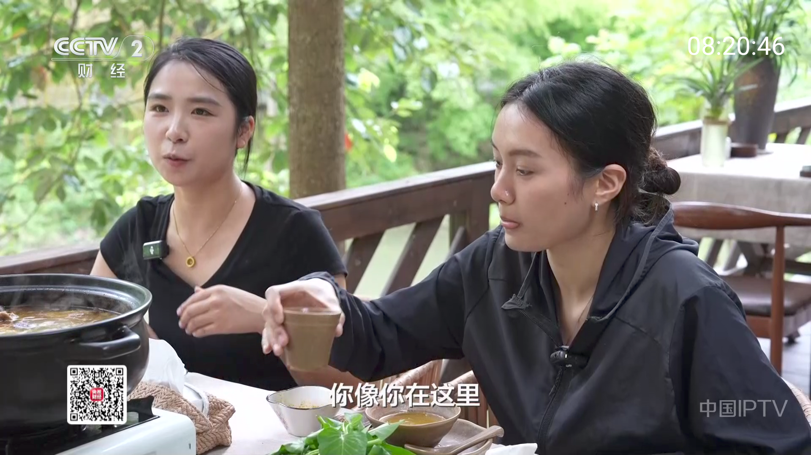
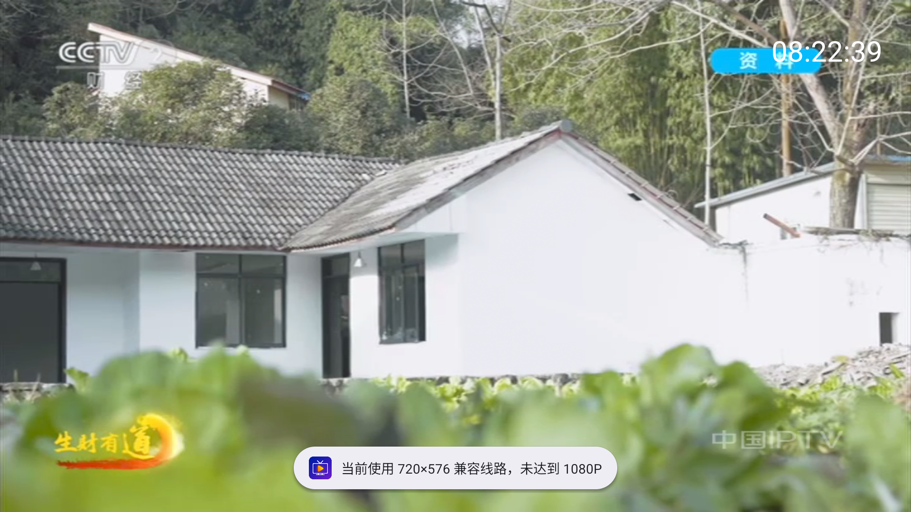

# 高清首选源修复与验证（2026-09-17）

## 目标与结论

使用地为四川成都，运营商未指定，按电信、联通、移动均需兼顾处理。用户选择：优先 1080P，高清候选失败后允许降低清晰度，并明确提示。

旧实现把“曾经出画”和稳定源记忆放在清晰度之前，启动时还会绕过完整频道列表，直接播放历史单线路。实测内置 CCTV2 的第一条线路只有 **720×576**，同频道已有两条 **1920×1080** 候选。此次修改统一选线规则，利用离线媒体尺寸和本机播放证据选线，避免历史低清源长期占据首选。

本次完成代码、离线质量快照、测量工具、单元测试和模拟器回归。属于未发布修改，版本号仍为 3.4.0，不代表线上 v3.4.0 已包含这些修复。

实现提交：`cd4c83c`。最终 Release APK SHA-256：`86885e28f91172da557b230aaf79428ada392d1a3aed5e9e7274343ccbe21e55`；证书 SHA-256：`7140a546cad30868adc2d18288166e3a10affdc213c55d4fdfb78a98166b7675`。

## 实现

1. **统一选择顺序**：未处于失败冷却期 → 实测全高清 → URL 清晰度线索 → 未知尺寸 → 实测低清；同为全高清时不因 4K 自动加权，优先本机稳定播放、播放成功记录和首帧速度，再参考网络兼容性与来源权重。低清兼容候选之间优先较大画面尺寸。
2. **真实尺寸优先**：必须同时满足宽 ≥1920、高 ≥1080 才进入全高清档。品牌域名、`HD` 标题、HTTP 200、1920×540 都不构成全高清证明。播放时记录的视频尺寸覆盖内置观察值。
3. **离线启动**：内置 `bundled_quality.json` 共 79 个媒体尺寸观察值，30 天过期；不用启动时全网测速，不以开发机的测速或失败结果设置用户的线路健康。已有频道缓存也会经过新排序。启动恢复的是完整列表中的频道，保留全部候选，而非旧单 URL 对象。
4. **三网与本机学习**：保留不同主机及运营商候选，候选池形成后重新保持质量顺序；首帧耗时与 HTTP 探测耗时分开记录，连续 30 秒无缓冲、无重试才记录稳定证据。接口、DNS、网关或本地地址变化时清除旧路由健康，保留媒体尺寸。无需公网运营商识别服务。
5. **高清失败再兼容**：对当前最多 8 条候选中的非冷却、已知全高清线路逐一尝试。每条受现有 8 秒首帧看门狗约束（2 秒轮询存在调度余量），不会因原 20 秒总启动预算提前跳过剩余高清候选。高清耗尽后允许一次尚未尝试的已知低清兼容线路；失败终止，不重新循环。无已知高清时维持原启动预算。关闭自动换线、用户手动选线及旧会话回调隔离仍受尊重。
6. **播放器与提示**：轨道选择目标为 1920×1080，避免无条件强推 4K；没有符合约束的轨道时使用 Media3 的兼容回退。实际视频尺寸不足全高清时显示“当前使用 720×576 兼容线路，未达到 1080P”等提示，每次调台同一线路不重复刷屏。频道信息和线路列表显示已知尺寸。

轨道约束依据 [Media3 TrackSelectionParameters.Builder](https://developer.android.com/reference/androidx/media3/common/TrackSelectionParameters.Builder)；没有启用强制最高码率。`SourcePreference` 是纯排序策略，`SourceSelection` 连接离线观察和本机健康，`PlaybackCoordinator` 负责有界恢复。

## 源测量

2026-09-17 对内置列表中 **26 个频道、102 个 URL** 进行了开发者主动探测：79 个返回有效视频尺寸，63 个达到 1920×1080 或以上。未响应仅表示该次、该测试网络失败，不全局封禁。

| 频道 | 已观察全高清及以上候选数 | 关键发现 |
| --- | ---: | --- |
| CCTV1 | 3 | 同频道仍有 720×576 线路，不能按台名判断 |
| CCTV2 | 2 | 原首线路为 720×576，新候选为 1920×1080 |
| 四川卫视 | 3 | 有实际 1920×1080 候选，也有超时线路 |
| 浙江卫视 | 5 | 包含全高清/更高尺寸候选 |
| 湖南卫视 | 2 | 观察到 HEVC 3840×2160，同时存在 1280×720 线路 |

对部分已验证 HLS URL 额外下载最多 4 MiB 的一个媒体分片样本：CCTV2 为 **33.87 Mbps**，四川卫视为 **21.79 Mbps**。两者均为截断样本，因此未推算完整分片平均码率。这些数字是当前测试主机的短时下载结果，不是视频编码码率、长期稳定速度或成都三网覆盖承诺。原始记录在 [evidence/2026-09-17-quality](evidence/2026-09-17-quality/)。

维护命令（在项目根目录执行）：

```text
python tools/audit_stream_quality.py --ffprobe <ffprobe路径> --titles CCTV1,CCTV2,四川卫视 --output <audit.json>
python tools/build_quality_snapshot.py <audit.json> [其他审计文件.json]
python tools/measure_hls_throughput.py <audit.json> --output <throughput.json>
```

`audit_stream_quality.py` 最多 80 个 URL、2 并发、单 URL 18 秒进程上限；`inspectionMs` 仅代表探测总时间。合并尺寸快照使用最早观察时间作为有效期起点，避免合并时把旧测量刷新成新数据。`build_bundled.py` 在重新生成频道列表时也读取有效尺寸，保留质量排序。

## 验证证据

- `:app:testReleaseUnitTest`：87 项，覆盖旧稳定低清与高清竞争、宽高双维度、冷却线路、同档首帧速度、720 与 240 回退、超过原启动预算仍尝试剩余高清、手动选择、关闭自动切换及频道会话隔离。
- `:app:assembleRelease --offline`：签名 Release 构建；APK 仍使用原证书，可 `adb install -r` 保留数据覆盖安装。
- 原目录 `D:/Android/avd/tv_api36.avd` 的 Android TV API 36 模拟器回归，没有卸载应用、清空偏好或替换 AVD。为取首帧日志临时安装同证书 Debug，之后恢复 Release。
- CCTV2 实际选择 `112.123.243.37` 的 1920×1080 线路；诊断日志从 `08:20:28.088` prepare 到 `08:20:29.764` 首帧约 **1.68 秒**，随后连续播放观察中无缓冲。CCTV1 同样记录 1920×1080 首帧。
- 手动选择过期旧线路能观察到源错误及恢复；手动选择 720×576 线路成功出画。最终 Release 截图确实显示“未达到 1080P”提示，没有仅依赖单元测试推断 UI。
- 最后一轮 87 测试构建覆盖安装后重新冷启动，MediaCodec 实际输出仍为 1920×1080，无 `FATAL EXCEPTION`。保留了最终播放截图及解码尺寸节选。





测试期间也出现过播放错误和长时间间隔后的停画，重新启动和针对性短时回归可以正常出画；不能把本次短时结果表述为长稳验收通过。

## 使用边界与后续验收

- 已改善默认选择策略并实测部分候选，但公共直播端点的带宽、有效期、节目内容及跨省/跨运营商可达性不由应用控制。目前没有成都三家运营商分别在晚高峰长时间观看的证据，不能承诺所有频道、所有时段至少 1080P 且高速。需要分别在目标家庭宽带补验首帧、30 分钟重缓冲、频道正确性和实际尺寸。
- 画面尺寸不是有效码率、逐行扫描方式或节目画质认证；本次没有对 63 条候选逐一完成这些认证。手机/电视硬件上的 HEVC 解码能力也需真机验证。
- 对于尚无实际尺寸、测量已过期或后端动态改变清晰度的 URL，仍需依靠播放时学习；未知线路可能实际是低清，此时明确提示，而不会凭标题保证 1080P。维护者应按上述工具定期更新离线快照。
- 本地路由指纹避免把显著网络切换前的经验直接套用到新网络，但不能识别保持相同局域网地址、网关、DNS 的所有上游 WAN 切换。
- 所谓“减少网络依赖”是频道列表、选择依据和历史经验可本地使用；实时视频传输仍需要足够、持续的网络带宽。
